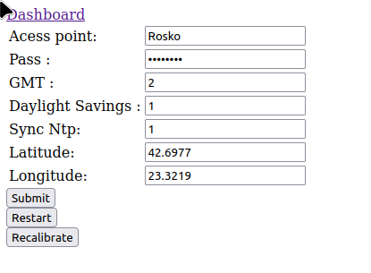
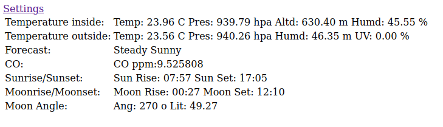

# weather-station
Reimplementation and extension [weatherstation](https://github.com/fandonov/weatherstation) 
uisng 2 Nodemcu esp32 in a master slave configuration.

## Sensors and Hardware
 - master node (weather_master.ino)
   - BME280 temperature/pressure/humidity sensor
   - DS3231-mini rtc
   - MQ-7 CO sensor

 - slave node (weather_outside.ino)
   - GUVA-S12SD analog UV sensor
   - BME280 temperature/pressure/humidity sensor


## Other hardware
 - generic SPI SD card adapter up to 32G
 - SSD1306 128x64 monochrome display

## Features
### Software features
 - Logging of sensor data on a set interval.
    - data from slave device - Temperature, Humidity, Pressure, UV index.
    - data from master device - Temperature, Humidity, Pressure, Altitude, CO ppm.
 - Clock syncing with ntp.
 - Clock with daylight savings/timezone adjustments.
 - Moon rise/set calculation using [MoonRise.h](https://www.arduino.cc/reference/en/libraries/moonrise/).
 - Moon angle and illuminated surface using [moonPhase.h](https://www.arduino.cc/reference/en/libraries/moonphase/).
 - Sun rise/set calculation [SunRise.h](https://www.arduino.cc/reference/en/libraries/sunrise/).
 - Showing curated information for the sensors on display.
 - Short term weather forecast and pressure trend using [zambretti algorithm](https://github.com/fandonov/weatherstation/blob/master/weather-station.ino) 
   (modified to have persistent data of past predictions with a file on the S card).
 - Persistent configuration of some parameters via a json file.
 - Battery % reporting from slave device. (currently unused)


### Network features
 - Connects to a wireless network with provided credentials.
 - Creates its own hotspot with baked in password and ssid if it cant find
   it/connect.
 - Very simple configuration page to edit some of the settings.
   Changing a setting would require a restart to take effect.
    
 - A simple dashboard to show information from sensors every few seconds.
    
 - Web pages are intentionally spartan and are more of a proof of concept.
 - Ntp client to synchronise clocks if connected to a network.
 - Slave device communicates over esp_now.

### Configuration
File should be placed in sd card root [conf.json](conf.json)
``` json
    {
        "ssid":"Rosko",       // ssid connect to
        "pass":"12345678",    // password for that network
        "dssid":"E32Wtr-St",  // ssid of default hotspot
        "dpass":"12345678",   // password to be set there
        "gmt":"2",            // gmt compensate
        "useds":"1",          // use Daylight savings
        "syncntp":"1",        // enable syncing with ntp
        "log_delay":"600000", // log interval in ms
        "lat":"42.6977",      // Latitude
        "lon":"23.3219"       // Longitude
    }
```

### Display
 - CO ppm
 - Atmospheric reading.s inside  (temp,pressure,altitude,humidity)
 - Atmospheric readings outside (temp,pressure,humidity, uv idx)
 - Time and Date, current IP of device
 - Time and Date adjusted with Daylight savings and Timezone, current IP of device
 - Time of Sunrise, Sunset, Moonrise, Moonset moon phase angle and illumination %
 - Weather forecast and Pressure trend
 - Runs in its own thread.

## Requirements
 - Moon and Sun calculations
    - MoonPhase
    - MoonRise
    - SunRise
 - CO detector
    - MQ7Sensor
 - SD card fs and Configuration
    - FS
    - SD
    - SPI
    - ArduinoJson
 - Web server
    - ESPAsyncWebSrv 
    - WiFiProv
    - WiFi
 - RTC
    - NTPClient
    - DS3231
 - Display
    - Adafruit_SSD1306
 - BME280
    - Adafruit_BME280

## Hardware Realisation


